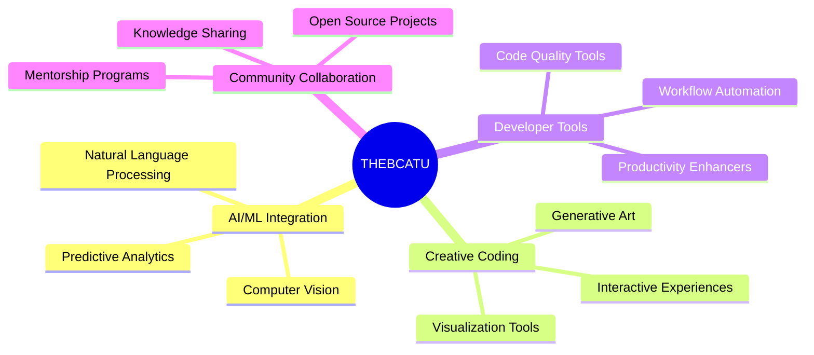

  
# ✨ THE-BCATU ✨
  

### *Transforming Innovative Ideas into Digital Reality*

## 🔍 About Us

> We're a dynamic team of developers dedicated to turning innovative ideas into reality. Our collaborative community embraces experimental projects, creative hacks, and out-of-the-box solutions that push the boundaries of what's possible.

📌 Our Mission

 
To foster a creative environment where experimental ideas flourish and innovative solutions are born through collaboration and technical excellence.

## 👨‍💻 Our Leadership Team

  

<table>
  <tr>
    <td align="center" width="33%">
      
        
      
        
      <b>Lead Admin</b>
       
      <i>Full-stack Developer</i>
       
      <i>Project Management</i>
        
      

        
        
      

    </td>
    <td align="center" width="33%">
      
        
      
        
      <b>Admin</b>
       
      <i>Innovation Lead</i>
       
      <i>Tool Development</i>
        
      

        
        
      

    </td>
    <td align="center" width="33%">
      
        
      
        
      <b>Admin</b>
       
      <i>AI/ML Specialist</i>
       
      <i>Research & Development</i>
        
      

        
        
      

    </td>
  </tr>
</table>

  

## 🚀 What We Do

<table>
  <tr>
    <td width="50%">
      <h3 align="center">🔮 Experimental Projects</h3>
      
Building innovative solutions that challenge conventional approaches

    </td>
    <td width="50%">
      <h3 align="center">🛠️ Developer Tools</h3>
      
Creating useful tools that enhance developer productivity and workflow

    </td>
  </tr>
  <tr>
    <td width="50%">
      <h3 align="center">🧠 AI/ML Applications</h3>
      
Exploring the frontiers of artificial intelligence and machine learning

    </td>
    <td width="50%">
      <h3 align="center">🎨 Creative Coding</h3>
      
Fostering solutions that blend technical excellence with creative expression

    </td>
  </tr>
</table>

## 💡 Current Focus

## 🤝 Join Our Community

We welcome contributors of all skill levels! Whether you're a seasoned developer or just starting out, there's a place for you in our community.

How to Contribute

 

1. **Browse our projects** to find something that interests you
2. **Fork the repository** and create your feature branch
3. **Submit a pull request** with your improvements
4. **Join discussions** in our community channels
5. **Share your ideas**, no matter how experimental!

## 📬 Connect With Us

  

  
### Team GitHub Profiles

## ⚡ Fun Fact

  
> "We believe the most groundbreaking ideas often start as experiments. Join us in turning creative concepts into reality! ✨"

⭐ *Star this repository if you find it interesting!* ⭐

